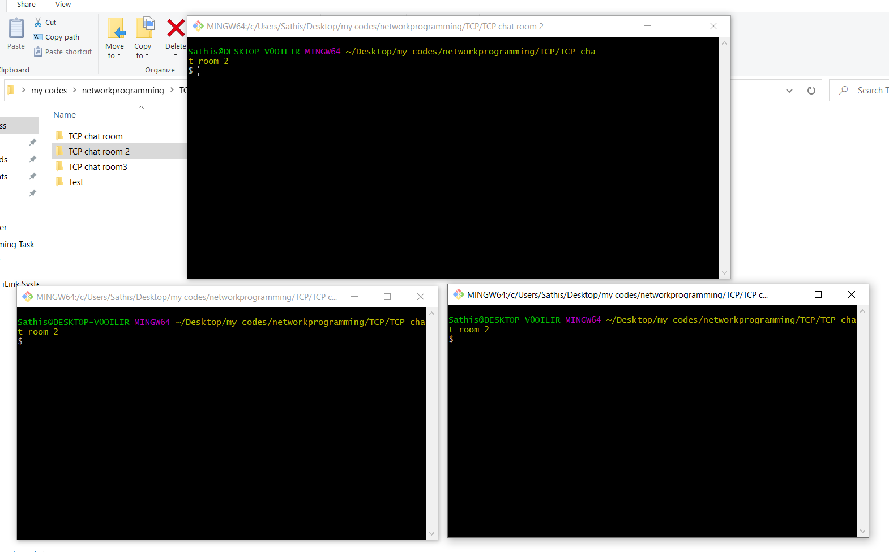
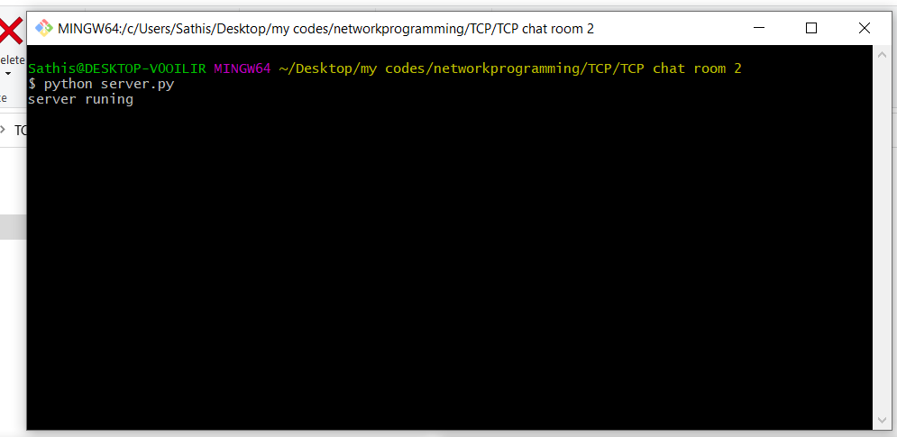
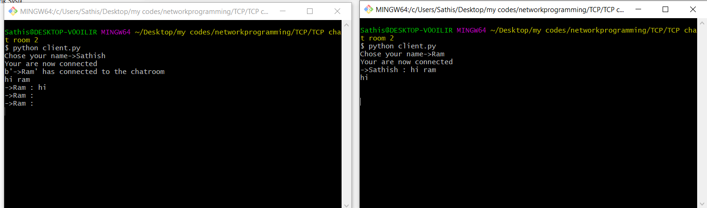

# TCP-IP-chat-room

Its a simple TCP/IP chat room with socket programming, binding with multiple clients

## User Manual:

### Step 1:

```

Open three cmd for the particluar directory where you clone this repositary

```
> As like this:



### Step 2:

```

Now run server.py file on any cmd terminal

```


### Step 3:

```

Run client.py file on the remaining cmd terminal and enter your name 

```



#### Click below to know more about sockets!

[sockets using python](https://docs.python.org/3/library/socket.html)

